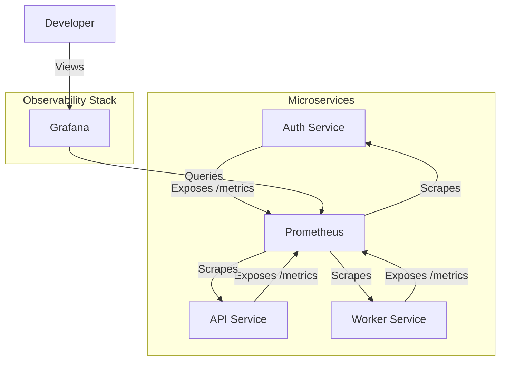

# Observability Implementation Guide

## Overview
This document details the implementation of the Observability stack for PixelFlow. We have successfully instrumented all microservices (Auth, API, Worker) with Prometheus metrics and visualized them using Grafana.

## Architecture
The observability pipeline consists of:
1.  **Instrumentation:** Go services use the Prometheus client library to expose metrics at `/metrics`.
2.  **Collection:** Prometheus server scrapes these endpoints every 15 seconds.
3.  **Visualization:** Grafana queries Prometheus and displays data in real-time dashboards.



## Technical Implementation Details

### 1. Metrics Strategy (RED Method)
We followed the **RED** method (Rate, Errors, Duration) for all HTTP services:
-   **Rate:** `requests_total` (Counter)
-   **Errors:** `requests_total{status=~"5.."}`
-   **Duration:** `request_duration_seconds` (Histogram)

### 2. Business Metrics
Custom metrics were added to track business value:
-   **Auth:** `auth_registrations_total`, `auth_logins_total`
-   **API:** `api_tasks_created_total`, `api_kafka_messages_published_total`
-   **Worker:** `worker_tasks_processed_total`, `worker_active_processing_tasks` (Gauge)

### 3. Logging Strategy
We replaced standard logging with **Structured Logging (`log/slog`)**:
-   **Format:** JSON (machine-readable)
-   **Context:** All logs include relevant context (e.g., `user_id`, `task_id`, `error`).
-   **Levels:** `Info` for normal ops, `Warn` for client errors, `Error` for system failures.

## Core Commands

### 🚀 Management
```bash
# Start all services
docker-compose up -d

# Restart specific service
docker-compose restart api-service

# View logs
docker-compose logs -f api-service
```

### 🔍 Verification
```bash
# Check Auth Metrics
curl -s http://localhost:50051/metrics | grep auth_

# Check API Metrics
curl -s http://localhost:8080/metrics | grep api_

# Check Worker Metrics
curl -s http://localhost:8081/metrics | grep worker_
```

### 📊 Access UI
-   **Grafana:** [http://localhost:3001](http://localhost:3001) (admin/admin)
-   **Prometheus:** [http://localhost:9090](http://localhost:9090)

## Service Details

### Auth Service
-   **Port:** 50051
-   **Metrics Port:** 50051 (same as app)
-   **Key Metrics:** Login success rate, Token validation latency.

### API Service
-   **Port:** 8080
-   **Metrics Port:** 8080 (same as app)
-   **Key Metrics:** Task upload rate, Kafka publish error rate.

### Worker Service
-   **Port:** N/A (Background Worker)
-   **Metrics Port:** 8081 (Dedicated HTTP server)
-   **Key Metrics:** Processing duration, Active tasks gauge.

## Next Steps
-   **Kubernetes Deployment:** Migrate Docker Compose setup to K8s manifests.
-   **Alerting:** Configure Prometheus AlertManager rules.
-   **Tracing:** Implement Jaeger for distributed tracing.
