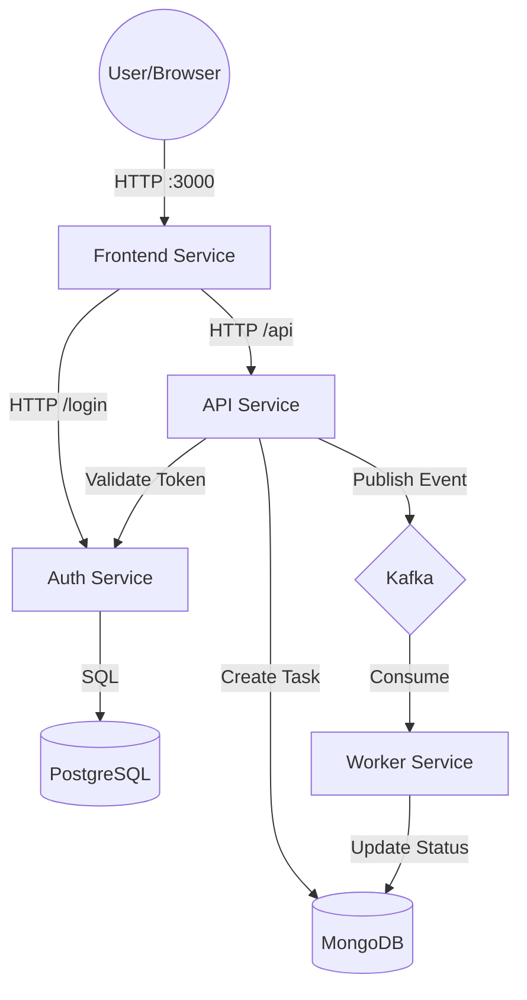

# PixelFlow - Distributed Image Processing Application

**A production-style distributed microservices application demonstrating modern backend, cloud-native, and event-driven patterns.**

[](https://github.com)
[](https://golang.org)
[](https://docker.com)

## 🎯 Project Overview

PixelFlow is a fully functional distributed system for asynchronous image processing, built with Go microservices, Kafka event streaming, and multiple databases. The application demonstrates:

- ✅ **Microservices Architecture** - 4 independent services (Frontend, Auth, API, Worker)
- ✅ **Event-Driven Design** - Kafka for async task processing
- ✅ **HTTP REST APIs** - Modern REST endpoints with JWT authentication
- ✅ **Polyglot Persistence** - PostgreSQL + MongoDB
- ✅ **Containerization** - Full Docker deployment
- ✅ **Production Patterns** - Health checks, structured logging, error handling

## 🏗️ Architecture



## 🚀 Quick Start

### Prerequisites
- Docker & Docker Compose
- Go 1.21+ (for local development)
- Make (included on macOS/Linux, or install via `brew install make` on Windows)

### Run the Application

```bash
# Clone the repository
git clone <repo-url>
cd harmonic-rosette

# Start all services (includes build)
make up

# Verify services are running
make ps

# Access the UI
# Open http://localhost:3000

# Run end-to-end tests
make test

# View logs
make logs
```

### Makefile Commands

```bash
make help          # Show all available commands
make up            # Start all services
make down          # Stop all services
make restart       # Restart services
make logs          # Follow logs from all services
make test          # Run E2E tests
make health        # Check service health
make clean         # Stop and remove all data (⚠️ destructive)

# Service-specific logs
make logs-frontend # Frontend logs
make logs-auth     # Auth service logs
make logs-api      # API service logs
make logs-worker   # Worker service logs

# Database access
make db-postgres   # PostgreSQL shell
make db-mongo      # MongoDB shell

# Kafka debugging
make kafka-topics    # List topics
make kafka-consumer  # Consume messages
make kafka-groups    # Show consumer groups
```

### Expected Output
```
✓ API Health Check Passed
✓ User Registration Successful
✓ Login Successful
✓ Token Validation Successful
✓ Task Created Successfully
✓ Task Listed Successfully
✓ Worker Processing Completed Successfully
```

## 📦 Services

### Frontend Service (Port 3000)
**User Interface**

- React SPA with TailwindCSS
- Dashboard for task management
- Real-time status updates

### Auth Service (Port 50051)
**User authentication and JWT management**

- `POST /register` - Create user account
- `POST /login` - Authenticate and get JWT
- `GET /validate` - Validate JWT token

**Stack**: Go + Gin + PostgreSQL + GORM + JWT + bcrypt

### API Service (Port 8080)
**REST API for task management**

- `GET /health` - Health check
- `POST /api/upload` - Create image processing task (requires auth)
- `GET /api/tasks` - List user's tasks (requires auth)

**Stack**: Go + Gin + MongoDB + Kafka Producer

### Worker Service
**Background task processor**

- Consumes from Kafka topic `image-tasks`
- Simulates image processing (5s delay)
- Updates task status: PENDING → PROCESSING → COMPLETED

**Stack**: Go + Kafka Consumer + MongoDB

## 🧪 API Usage Examples

### 1. Register User
```bash
curl -X POST http://localhost:50051/register \
  -H "Content-Type: application/json" \
  -d '{"email":"user@example.com","password":"secret123"}'
```

### 2. Login
```bash
curl -X POST http://localhost:50051/login \
  -H "Content-Type: application/json" \
  -d '{"email":"user@example.com","password":"secret123"}'
# Returns: {"token":"eyJhbGc..."}
```

### 3. Create Task
```bash
TOKEN="<your-jwt-token>"
curl -X POST http://localhost:8080/api/upload \
  -H "Authorization: Bearer $TOKEN" \
  -H "Content-Type: application/json" \
  -d '{"image_url":"https://example.com/image.jpg"}'
```

### 4. Check Task Status
```bash
curl -X GET http://localhost:8080/api/tasks \
  -H "Authorization: Bearer $TOKEN"
```

## 🗂️ Project Structure

```
.
├── apps/
│   ├── auth/           # Auth Service (HTTP)
│   │   ├── cmd/        # Main entry point
│   │   └── internal/   # Models, DB, Utils
│   ├── api/            # API Service (HTTP)
│   │   ├── cmd/
│   │   └── internal/   # Middleware, Kafka, Models
│   ├── worker/         # Worker Service
│   │   ├── cmd/
│   │   └── internal/   # Kafka Consumer, Processor
│   └── frontend/       # Frontend UI
│       ├── src/        # React Components & Pages
│       └── public/
├── docker-compose.yml  # All services orchestration
├── test_e2e.sh        # End-to-end test script
└── README.md
```

## 🔧 Development

### Local Development (without Docker)

```bash
# Terminal 1: Start infrastructure
docker-compose up postgres-auth mongo kafka zookeeper -d

# Terminal 2: Run Auth Service
cd apps/auth
go run cmd/main.go

# Terminal 3: Run API Service
cd apps/api
go run cmd/main.go

# Terminal 4: Run Worker Service
cd apps/worker
go run cmd/main.go

# Terminal 5: Run Frontend
cd apps/frontend
npm start
```

### View Logs

```bash
# All services
docker-compose logs -f

# Specific service
docker-compose logs -f worker-service
docker-compose logs -f api-service
docker-compose logs -f auth-service
docker-compose logs -f frontend
```

### Stop Services

```bash
docker-compose down        # Stop containers
docker-compose down -v     # Stop and remove volumes
```

## 📊 Monitoring

### Health Checks
```bash
# API Service
curl http://localhost:8080/health
# {"status":"ok"}
```

### Database Access
```bash
# MongoDB
docker exec -it pixelflow-mongo mongosh
use pixelflow
db.tasks.find()

# PostgreSQL
docker exec -it pixelflow-postgres-auth psql -U postgres -d auth_db
SELECT * FROM users;
```

### Kafka Topics
```bash
# List topics
docker exec pixelflow-kafka kafka-topics --list --bootstrap-server localhost:9092

# Consume messages
docker exec pixelflow-kafka kafka-console-consumer \
  --topic image-tasks \
  --from-beginning \
  --bootstrap-server localhost:9092
```

## 🎓 Key Learning Outcomes

### Backend Development
- RESTful API design with Gin framework
- JWT authentication and authorization
- Database modeling (relational + document)
- ORM patterns with GORM

### Distributed Systems
- Microservices architecture patterns
- Event-driven design with Kafka
- Service-to-service communication
- Async task processing
- Database per service pattern

### DevOps & Cloud-Native
- Docker containerization
- Docker Compose orchestration
- Service discovery and networking
- Health checks and monitoring
- Structured logging

### Scalability
- Horizontal scaling with Kafka consumer groups
- Stateless service design
- Message queues for decoupling
- Database optimization patterns

## 🛠️ Tech Stack

| Component | Technology |
|-----------|-----------|
| **Language** | Go 1.21+ |
| **Frontend** | React 18, TailwindCSS |
| **API Framework** | Gin |
| **Auth Database** | PostgreSQL 15 |
| **Task Database** | MongoDB 6.0 |
| **Message Queue** | Apache Kafka 7.3 |
| **ORM** | GORM |
| **Containerization** | Docker, Docker Compose |

## ✅ Verified Features

- [x] **Frontend UI**: Login, Register, Dashboard, Task Upload
- [x] User registration with password hashing (bcrypt)
- [x] JWT-based authentication
- [x] Protected API endpoints with middleware
- [x] Task persistence in MongoDB
- [x] Kafka event publishing
- [x] Worker consumption and processing
- [x] Status updates (PENDING → PROCESSING → COMPLETED)
- [x] Full end-to-end workflow tested
- [x] Docker deployment
- [x] Health checks
- [x] Structured logging

## 🔍 Observability & Troubleshooting

### Structured Logging
All services output logs in **JSON format** (Structured Logging) for easy parsing and monitoring.

#### Viewing Logs
Use the following commands to view logs for each service:

```bash
# Auth Service (User registration/login)
docker-compose logs -f auth-service

# API Service (Task creation/listing)
docker-compose logs -f api-service

# Worker Service (Background task processing)
docker-compose logs -f worker-service

# All services
docker-compose logs -f

# Filter by log level
docker-compose logs auth-service | grep '"level":"ERROR"'
```

### Prometheus Metrics

Prometheus is deployed for real-time metrics collection and monitoring.

**Access Prometheus UI:** http://localhost:9091

#### Available Metrics

**Auth Service** (`http://localhost:50051/metrics`):
- `auth_requests_total{method, endpoint, status}` - HTTP request counter
- `auth_request_duration_seconds{method, endpoint}` - Request latency histogram
- `auth_registrations_total` - Total user registrations
- `auth_logins_total{status}` - Login attempts (success/failure)
- `auth_token_validations_total{status}` - JWT token validations

#### Useful PromQL Queries

```promql
# Request rate (requests per second)
rate(auth_requests_total[5m])

# P95 latency
histogram_quantile(0.95, rate(auth_request_duration_seconds_bucket[5m]))

# Login success rate (percentage)
sum(rate(auth_logins_total{status="success"}[5m])) / sum(rate(auth_logins_total[5m])) * 100

# Registrations in last hour
increase(auth_registrations_total[1h])

# Error rate
rate(auth_requests_total{status=~"5.."}[5m])
```

#### Prometheus Troubleshooting

**Check Targets Status:**
```bash
# View all scrape targets
curl -s 'http://localhost:9091/api/v1/targets' | jq '.data.activeTargets[] | {job: .labels.job, health: .health}'

# Expected output:
# {"job": "auth-service", "health": "up"}
# {"job": "prometheus", "health": "up"}
```

**Verify Metrics Endpoint:**
```bash
# Check if Auth Service exposes metrics
curl http://localhost:50051/metrics | head -20

# Query specific metric via Prometheus API
curl -s 'http://localhost:9091/api/v1/query?query=auth_requests_total' | jq
```

**Common Issues:**

1. **Target shows as DOWN**
   ```bash
   # Check if service is running
   docker ps | grep pixelflow-auth
   
   # Verify /metrics endpoint is accessible
   curl http://localhost:50051/metrics
   
   # Check Prometheus logs
   docker logs pixelflow-prometheus
   ```

2. **No data in Prometheus**
   - Wait 15 seconds for first scrape (default scrape interval)
   - Generate traffic to the service (register/login)
   - Verify target is UP: http://localhost:9091/targets

3. **Metrics not updating**
   - Check time range in Prometheus UI (last 5m, 1h, etc.)
   - Verify service is receiving requests
   - Confirm scrape interval: 15 seconds (in `prometheus.yml`)

4. **High validation request count**
   - Frontend dashboard polls `/api/tasks` every 3 seconds
   - Each API call validates JWT with Auth Service
   - This is normal behavior (20 requests/minute when dashboard is open)

**Prometheus Configuration:**
- Config file: `deploy/prometheus/prometheus.yml`
- Scrape interval: 15 seconds
- Data retention: 15 days (default)
- Storage: Docker volume `prometheus_data`

**Documentation:**
- Comprehensive guide: [`deploy/prometheus/PROMETHEUS_GUIDE.md`](deploy/prometheus/PROMETHEUS_GUIDE.md)
- Auth Service metrics: [`apps/auth/METRICS.md`](apps/auth/METRICS.md)

#### 2. Task Not Processing
Check `worker-service` logs. You should see "Received task" followed by "Task completed successfully".
```bash
docker-compose logs -f worker-service
```

#### 3. API Errors
Check `api-service` logs for "Upload: Failed" or middleware errors.
```bash
docker-compose logs -f api-service
```

### Troubleshooting & Debugging

### Common Issues and Solutions

#### 1. Port Already in Use
**Problem**: Docker fails to start with "bind: address already in use"

**Debug**:
```bash
# Check what's using the port
lsof -ti:8080   # API port
lsof -ti:50051  # Auth port
lsof -ti:27017  # MongoDB port
lsof -ti:3000   # Frontend port
```

**Solution**:
```bash
# Kill the process using the port
lsof -ti:8080 | xargs kill -9
lsof -ti:50051 | xargs kill -9

# Or change the port in docker-compose.yml
```

#### 2. Docker Build Failures
**Problem**: Go module dependency conflicts, missing go.sum entries

**Debug**:
```bash
# View full build logs
docker-compose build --no-cache 2>&1 | tee build.log

# Check Go version in container
docker run golang:latest go version
```

**Issues Encountered**:
- ❌ `go.work` version conflicts (`go 1.21` in workspace vs `go 1.24.0` in modules)
- ❌ Missing `go.sum` entries for transitive dependencies
- ❌ Protobuf/gRPC complexity with `pkg/pb` module

**Solutions Applied**:
- ✅ Remove `go.work` files in Docker build (`RUN rm -f go.work go.work.sum`)
- ✅ Run `go mod tidy` before `go build` in Dockerfile
- ✅ Use `golang:latest` instead of RC versions
- ✅ **Simplified to HTTP REST** - removed gRPC/protobuf entirely

#### 3. Database Connection Issues
**Problem**: Services can't connect to PostgreSQL/MongoDB

**Debug**:
```bash
# Check if databases are healthy
docker-compose ps

# Test PostgreSQL connection
docker exec -it pixelflow-postgres-auth psql -U postgres -c '\l'

# Test MongoDB connection
docker exec -it pixelflow-mongo mongosh --eval "db.adminCommand('ping')"

# Check database logs
docker-compose logs postgres-auth
docker-compose logs mongo
```

**Common Causes**:
- Database container not ready (use `depends_on` with `healthcheck`)
- Wrong credentials in environment variables
- Network connectivity between containers

#### 4. Kafka Connection Refused
**Problem**: Worker can't connect to Kafka

**Debug**:
```bash
# Check Kafka is running
docker-compose logs kafka

# Check Zookeeper (required for Kafka)
docker-compose logs zookeeper

# Verify Kafka listener configuration
docker exec pixelflow-kafka kafka-broker-api-versions --bootstrap-server localhost:9092

# Check topic exists
docker exec pixelflow-kafka kafka-topics --list --bootstrap-server localhost:9092
```

**Solution**:
- Wait ~10-20 seconds after `docker-compose up` for Kafka to fully initialize
- Ensure Zookeeper is healthy first
- Use correct broker address: `kafka:29092` (internal) vs `localhost:9093` (external)

#### 5. Worker Not Processing Tasks
**Problem**: Tasks stay in PENDING status

**Debug**:
```bash
# Check worker logs
docker-compose logs -f worker-service

# Verify Kafka messages are being published
docker exec pixelflow-kafka kafka-console-consumer \
  --topic image-tasks \
  --from-beginning \
  --bootstrap-server localhost:9092

# Check MongoDB for task status
docker exec -it pixelflow-mongo mongosh
> use pixelflow
> db.tasks.find().pretty()
```

**Common Causes**:
- Worker not consuming from Kafka (check consumer group)
- Kafka connection issues (see #4)
- Worker crashed (check logs for panics)

#### 6. Authentication Failures
**Problem**: API returns 401 Unauthorized

**Debug**:
```bash
# Test auth service directly
curl -X POST http://localhost:50051/login \
  -H "Content-Type: application/json" \
  -d '{"email":"test@example.com","password":"password123"}'

# Validate the token
TOKEN="<your-token>"
curl -X GET http://localhost:50051/validate \
  -H "Authorization: Bearer $TOKEN"

# Check auth service logs
docker-compose logs -f auth-service
```

**Common Issues**:
- Token expired (default: 24 hours)
- Wrong secret key between services
- Auth service not responding

### Debugging Commands Reference

```bash
# === Container Management ===
docker-compose ps                    # List all containers
docker-compose logs -f <service>     # Follow logs for specific service
docker-compose logs --tail=50        # Last 50 lines from all services
docker-compose restart <service>     # Restart specific service
docker-compose down -v               # Stop and remove volumes (CAUTION: deletes data)

# === Database Access ===
# PostgreSQL
docker exec -it pixelflow-postgres-auth psql -U postgres -d auth_db
# Inside psql:
\dt                                  # List tables
SELECT * FROM users;                 # Query users

# === MongoDB ===
docker exec -it pixelflow-mongo mongosh
# Inside mongosh:
use pixelflow                        # Switch to pixelflow DB
db.tasks.find()                      # List all tasks
db.tasks.countDocuments()            # Count tasks

# === Kafka Debugging ===
# List topics
docker exec pixelflow-kafka kafka-topics \
  --list --bootstrap-server localhost:9092

# Consume messages
docker exec pixelflow-kafka kafka-console-consumer \
  --topic image-tasks \
  --from-beginning \
  --bootstrap-server localhost:9092

# Check consumer groups
docker exec pixelflow-kafka kafka-consumer-groups \
  --list --bootstrap-server localhost:9092

# Describe consumer group
docker exec pixelflow-kafka kafka-consumer-groups \
  --describe --group worker-group-1 \
  --bootstrap-server localhost:9092

# === Network Debugging ===
# Check container network
docker network ls
docker network inspect harmonic-rosette_pixelflow-net

# Test connectivity between containers
docker exec pixelflow-api ping -c 3 pixelflow-auth
docker exec pixelflow-worker ping -c 3 kafka

# === Service Health Checks ===
curl http://localhost:8080/health    # API health
curl http://localhost:50051/validate # Auth health (needs token)

# === Build Debugging ===
# Rebuild without cache
docker-compose build --no-cache

# Build specific service
docker-compose build auth-service

# View build context
docker-compose config

# === Resource Usage ===
docker stats                         # Real-time container stats
docker system df                     # Disk usage
docker system prune                  # Clean up unused resources
```

### Problems We Encountered During Development

1. **Go Module Version Conflicts** ⚠️
   - Original issue: `go.work` with `go 1.21` vs modules requiring `go 1.24+`
   - Attempted: Downgrading dependencies, using RC Go versions
   - Solution: Removed `go.work` in Docker, used `golang:latest`

2. **gRPC/Protobuf Complexity** ⚠️
   - Original design: gRPC between services with shared `pkg/pb` module
   - Issue: Complex build process, protobuf generation, module dependencies
   - Solution: **Simplified to HTTP REST** - major architectural change but much cleaner

3. **Missing go.sum Entries** ⚠️
   - Issue: Docker builds failing with "missing go.sum entry" for transitive deps
   - Attempted: `go mod download`, `go get ./...`, deleting go.sum files
   - Solution: Keep go.sum files, run `go mod tidy` before build

4. **Docker Network Configuration** ⚠️
   - Issue: Services using wrong hostnames/ports
   - Solution: Use service names in docker-compose network, internal ports (e.g., `kafka:29092`)

5. **Port Conflicts** ⚠️
   - Issue: Ports 8080, 50051 already in use from previous local runs
   - Solution: Kill processes or stop local services before `docker-compose up`

### Tips for Success

✅ **Always check logs first**: `docker-compose logs -f <service>`  
✅ **Use health checks**: Wait for databases to be healthy before starting services  
✅ **Test components individually**: Verify auth, then API, then worker  
✅ **Use the E2E test script**: `./test_e2e.sh` validates the full workflow  
✅ **Keep it simple**: HTTP REST is easier to debug than gRPC for learning projects

## 🚧 Future Enhancements
 
 ### Cloud-Native & Deployment
 - [ ] **Kubernetes Deployment**: Deploy services to K8s using manifests (Deployments, Services, Ingress)
 - [ ] **Helm Charts**: Package application as a Helm chart for easy versioning and deployment
 - [ ] **CI/CD Pipeline**: Automate testing and deployment using GitHub Actions or GitLab CI
 - [ ] **Service Mesh**: Implement Istio or Linkerd for advanced traffic management and security
 
 ### API Documentation
 - [ ] **Swagger/OpenAPI**: Auto-generate OpenAPI spec from Go code using `swaggo/swag`
 - [ ] **Swagger UI**: Serve interactive API documentation at `/docs` endpoint
 
 ### Reliability & Scalability
 - [ ] **Retry Logic & DLQ**: Implement Dead Letter Queues for failed Kafka messages
 - [ ] **Rate Limiting**: Add Redis-based rate limiting to API service
 - [ ] **Circuit Breakers**: Implement circuit breakers for service-to-service calls
 - [ ] **Caching**: Add Redis caching for frequently accessed data (e.g., user profiles)
 
 ### Features
 - [ ] **Real-time Updates**: Implement WebSockets for real-time task status updates on frontend
 - [ ] **Email Notifications**: Send emails upon task completion using an SMTP provider
 - [ ] **Multi-tenancy**: Support multiple organizations/teams with data isolation

## 📝 License

MIT License - See LICENSE file for details

## 🤝 Contributing

This is a learning project. Feel free to fork and experiment!

---

**Built with ❤️ to learn distributed systems and microservices**
